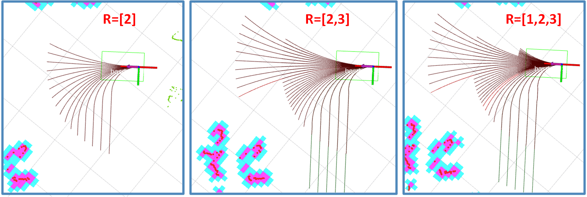

# DWAL Planner
## _Dynamic Window Arc-Line Planner_

## Overview

The DWAL Planner is a ROS package for creating motion clusters while moving in an obstacle-laden environment. The package has been tested in an office environment, where it works best. It's based on the well known Dynamic Window Approach but instead of projecting arcs ahead, it uses a combination of arcs and lines. These are checked for colission up to a circle of set radius ahead, the so-called *level*. To use it you must have:

- a robot
- an odometry source
- a laserscan source
- a working tf

The **tf** should include the transformation of *base\_link* to the *odom* frame, as well as the laser frame to the *base\_link* frame.

**Author: George Moustris<br />
Affiliation: [Intelligent Robotics & Automation Lab @ ECE/NTUA](https://www.robotics.ntua.gr/)<br />**

<table> 
    <tr> 
        <td></td> 
        <td></td> 
    </tr> 
</table> 


For more technical information see the papers below:

*Moustris, G.P., and C. S. Tzafestas. “**Intention-Based Front-Following Control for an Intelligent Robotic Rollator in Indoor Environments.**” In Computational Intelligence (SSCI), 2016 IEEE Symposium Series On, 1–7. IEEE, 2016.* <a href="https://www.researchgate.net/publication/311571550_Intention-Based_Front-Following_Control_for_an_Intelligent_Robotic_Rollator_in_Indoor_Environments"> (PDF in RG) </a>

*Moustris, G. P., and C. S. Tzafestas. “**Assistive Front-Following Control of an Intelligent Robotic Rollator Based on a Modified Dynamic Window Planner.**” In 2016 6th IEEE International Conference on Biomedical Robotics and Biomechatronics (BioRob), 588–93, 2016.* <a href="https://www.researchgate.net/publication/304582138_Assistive_Front-Following_Control_of_an_Intelligent_Robotic_Rollator_based_on_a_Modified_Dynamic_Window_Planner"> (PDF in RG) </a>

## Features

- Simulate admissible paths into the environment to detect colission
- Produce admissible clusters of motion
- Can simulate paths in more than one levels at the same time
- Publish the simulated paths, up to their colission point
- Publish the available motion clusters in different colors
- Use services to actually toggle levels on and off
- You can also toggle *directional slicing* of clusters (see the papers for details)


## Installation

Download the package into your ROS workspace and catkin_make it. This is a ROS 1 version (noetic build).
```sh
cd catkin_workspace/src
git clone https://github.com/gmoustri/dwal_planner.git
cd ../
catkin_make
```

## How to run

Just launch the dwal.launch file.

```sh
roslaunch dwal_planner dwal.launch
```
## Nodes
### Node: dwal_generator

This node receives the laser scan and the odometric information, and produces the path bundle i.e. all the simulated paths up to their colission point. It creates the rolling costmap which follows the robot, marking obstacles along the way. The costmap only marks the space *ahead*.


#### Subscribed Topics

* **`/[odomTopic]`** ([nav_msgs/Odometry])

    The odometry topic. This is defined by the */odometryTopic* parameter.

* **`/[Laser Topic]`** ([sensor_msgs/LaserScan])

    The topic of the lidar sensor facing forwards. This is used by the costmap and is defined in the corresponding costmap parameters (see [below](#costmap-parameters)).

#### Published Topics

* **`~/sampled_paths`** ([dwal_planner/Sampled_Cluster])

    This topic contains the path bundle in a custom message type.
    
* **`~/sampled_pathMarkers`** ([visualization_msgs/MarkerArray])

    Rviz markers to visualize the computed path bundle.
        
    
### Node: dwal_clustering

This node receives the sampled path bundle from the *dwal_generator* node and performs clustering over the paths. It publishes the clusters to the appropriate topics.

#### Subscribed Topics

* **`~/sampled_paths`** ([dwal_planner/Sampled_Cluster])

    The path bundle as published by the *dwal_generator* node

#### Published Topics

* **`~/clusters_[postfix]`** ([dwal_planner/Cluster_Group])

    This topic contains the path cluster of the specific level. Corresponds to one topic per level, as defined in the [Path Clustering Parameters](#path-clustering-parameters)
    
* **`~/cluster_markers_[postfix]`** ([visualization_msgs/MarkerArray])

    Rviz markers to visualize the computed path bundle.
    
 #### Services

* **`toggle_cluster_spin`** ([std_srvs/Empty])
    
    Activate/deactive each level for the computation of clusters. Service accepts an *int32[]* array of '0s' and '1s', setting and usetting each corresponding level. For example calling the service with [0,1,1] will deactive the first level in the clustering process, and allow the rest two (if there are three levels)
    
 * **`toggle_cluster_slice`** ([std_srvs/Empty])
    
    Perform directional slicing between source and target cluster groups.

## Parameters
The parameters are broken into 3 groups; the first defines the rolling costamp; the second defines the generation of the paths and the third sets the clustering conditions. These are located in the file **dwal_params.yaml** in the top folder.

### General Parameters

* **`odometryTopic`** (string, default: "/odom")

    The name of the odometry topic. 

### Costmap Parameters
* **`dwal_generator/dwal_cmap`** 

Parameters for the rolling costmap. See <a href="http://wiki.ros.org/costmap_2d#costmap_2d.2Flayered.Parameters">here</a> for details. An example is given below:
   
```yaml
dwal_generator/dwal_cmap:
  footprint: [[-0.1,-0.3], [-0.1,0.3], [0.8,0.3], [0.8,-0.3]]
  global_frame: odom
  robot_base_frame: base_link
  rolling_window: true
  update_frequency: 5.0
  publish_frequency: 2.0
  transform_tolerance : 0.4
  width: 9.0
  height: 9.0
  max_obstacle_height: 1.5
  obstacle_range: 4
  raytrace_range: 4.5
  resolution: 0.1
  inflation_radius: 0.1
  plugins: 
    - {name: obstacles, type: "costmap_2d::VoxelLayer"}
    - {name: inflation, type: "costmap_2d::InflationLayer"}
  obstacles:
    observation_sources: laser_scanner_front
    laser_scanner_front: {data_type: LaserScan, topic: /front_scan, sensor_frame: front_laser, marking: true, clearing: true,  observation_persistence: 0.5}
```
The costamp does not use an external map. Thus the *global\_frame* parameter **should be _odom_**. Also, the *footprint* parameter is used to calculate the colission with the robot's footprint.

### Path Generation Parameters

* **`dwal_generator\max_vel_trans`** (number, default: 0.3)

    maximum linear velocity for the Dynamic Window in m/sec
* **`dwal_generator\min_vel_trans`** (number, default: 0.1)

    minimum linear velocity for the Dynamic Window in m/sec

* **`dwal_generator\max_vel_theta`** (number, default: 1.0)

    maximum angular velocity for the Dynamic Window in rad/sec

* **`dwal_generator\acc_lim_x`** (number, default: 1.5)

    maximum linear acceleration for the Dynamic Window, in m/sec^2

* **`dwal_generator\acc_lim_th`** (number, default: 3.2)

    maximum angular acceleration for the Dynamic Window, in rad/sec^2
    
* **`dwal_generator\sim_period`** (number, default: 0.2)

    time window to calculate the maximum velocities for the Dynamic Window. For example, the maximum linear velocity is v_cur+acc_lim_th\*sim_period where v_cur is the robot's current linear velocity

* **`dwal_generator\DS`** (number, default: 0.1)

    length step to sample a path i.e. each path point is produced every *DS* meters on the path

* **`dwal_generator\Kmax`** (number, default: 2.0)

    maximum (and minimum) curvature of simulated paths. Minimum curvature is *-Kmax*
    
* **`dwal_generator\Hz`** (number, default: 10.0)

    the rate to produce the path bundle.


### Path Clustering Parameters

* **`dwal_clustering\min_cluster_span`** (number, default: 0.2)

    the minimum span a cluster should have (in meters). This is the chord connecting the first and last cluster paths on the level's circle. Essentially it defines the minimum width of a cluster. If a cluster's width is below this number, **the cluster is discarded**.
    
 * **`dwal_clustering\cluster_separation`** (number, default: 5)

    minimum number of paths between clusters. Two cluster that are seperated by less than this number, are considered *one cluster*.  
    
 * **`dwal_clustering\levels`** (array of numbers, default: [2.0])

    defines the number of levels and the radii. By default it starts with only one level (see example below)
    
 * **`dwal_clustering\postfix`** (array of strings, default: ['near'])

    appends each *string* of the array at the names of the clusters. Each level is published with this string as postfix. **Must have the same number of elements as the _levels_ parameter!**
    
 * **`dwal_clustering\spin`** (array of numbers, default: [1])

    whether to start clustering each level, when the node starts. A value of "1" means to include the according level. "0" means to disregard it. **Must have the same number of elements as the _levels_ parameter!**

Examples of the last three parameters are given below:

> One cluster named 'near' with Radius=2m
```yaml
dwal_clustering:
  levels: [2.0]
  postfix: ['near']
  spin: [1]
```
> Two clusters named 'near' and 'far' with Radii 2m and 3m
```yaml
dwal_clustering:
  levels: [2.0, 3.0]
  postfix: ['near', 'far']
  spin: [1, 1]
```
 > Three clusters named 'near', 'far' and 'away' with Radii 1m, 2m and 3m
```yaml
dwal_clustering:
  levels: [1.0, 2.0, 3.0]
  postfix: ['near', 'far', 'away']
  spin: [1, 1, 1]
```


## Citations
If you like this work and use it in your own, please cite the following publications:

* > Moustris, G. P., and C. S. Tzafestas.
  > “**Assistive Front-Following Control of an Intelligent Robotic Rollator Based on a Modified Dynamic Window Planner.**” 
  > In 2016 6th IEEE International Conference on Biomedical Robotics and Biomechatronics (BioRob), 588–93, 2016.

        @INPROCEEDINGS{7523689,
          author={Moustris, George P. and Tzafestas, Costas S.},
          booktitle={2016 6th IEEE International Conference on Biomedical Robotics and Biomechatronics (BioRob)}, 
          title={Assistive front-following control of an intelligent robotic rollator based on a modified dynamic window planner}, 
          year={2016},
          volume={},
          number={},
          pages={588-593},
          doi={10.1109/BIOROB.2016.7523689}}

* > Moustris, G.P., and C. S. Tzafestas. 
  > **“Intention-Based Front-Following Control for an Intelligent Robotic Rollator in Indoor Environments.”**
  > In Computational Intelligence (SSCI), 2016 IEEE Symposium Series On, 1–7. IEEE, 2016

        @INPROCEEDINGS{7850067,
          author={Moustris, George P. and Tzafestas, Costas S.},
          booktitle={2016 IEEE Symposium Series on Computational Intelligence (SSCI)}, 
          title={Intention-based front-following control for an intelligent robotic rollator in indoor environments}, 
          year={2016},
          volume={},
          number={},
          pages={1-7},
          doi={10.1109/SSCI.2016.7850067}}


## License
BSD-3-Clause license 


[nav_msgs/odometry]: http://docs.ros.org/en/noetic/api/nav_msgs/html/msg/Odometry.html
[visualization_msgs/MarkerArray]: http://docs.ros.org/en/noetic/api/visualization_msgs/html/msg/MarkerArray.html
[sensor_msgs/LaserScan]: http://docs.ros.org/en/noetic/api/sensor_msgs/html/msg/LaserScan.html
[dwal_planner/Cluster_Group]: https://github.com/gmoustri/dwal_planner/blob/main/msg/Path_Cluster.msg
[dwal_planner/Sampled_Cluster]: https://github.com/gmoustri/dwal_planner/blob/main/msg/Sampled_Cluster.msg
[std_srvs/Empty]: http://docs.ros.org/en/noetic/api/std_srvs/html/srv/Empty.html
