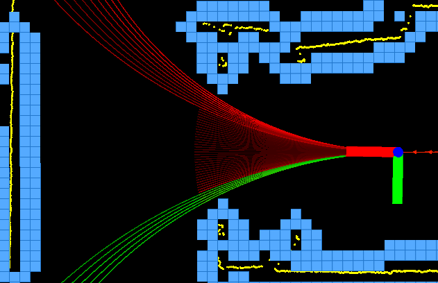

# DWAL Planner
## _Dynamic Window Arc-Line Planner_

The DWAL Planner is a ROS package for creating motion clusters while moving in an obstacle-laden environment. The package has been tested in an office environment, where it works best. It's based on the well known Dynamic Window Approach but instead of projecting arcs ahead, it uses a combination of arcs and lines. To use it you must have:
- a robot
- an odometry source
- a laserscan source



For more information see the papers below:

Moustris, G.P., and C. S. Tzafestas. “Intention-Based Front-Following Control for an Intelligent Robotic Rollator in Indoor Environments.” In Computational Intelligence (SSCI), 2016 IEEE Symposium Series On, 1–7. IEEE, 2016. http://ieeexplore.ieee.org/abstract/document/7850067/.

Moustris, G. P., and C. S. Tzafestas. “Assistive Front-Following Control of an Intelligent Robotic Rollator Based on a Modified Dynamic Window Planner.” In 2016 6th IEEE International Conference on Biomedical Robotics and Biomechatronics (BioRob), 588–93, 2016. https://doi.org/10.1109/BIOROB.2016.7523689.

## Features

- Import a HTML file and watch it magically convert to Markdown
- Drag and drop images (requires your Dropbox account be linked)
- Import and save files from GitHub, Dropbox, Google Drive and One Drive
- Drag and drop markdown and HTML files into Dillinger
- Export documents as Markdown, HTML and PDF

Markdown is a lightweight markup language based on the formatting conventions
that people naturally use in email.
As [John Gruber] writes on the [Markdown site][df1]

> The overriding design goal for Markdown's
> formatting syntax is to make it as readable
> as possible. The idea is that a
> Markdown-formatted document should be
> publishable as-is, as plain text, without
> looking like it's been marked up with tags
> or formatting instructions.

This text you see here is *actually- written in Markdown! To get a feel
for Markdown's syntax, type some text into the left window and
watch the results in the right.

## Installation

Download the package into your ROS workspace and catkin_make it. This is a ROS1 version (noetic build).


## Development

Want to contribute? Great!

Dillinger uses Gulp + Webpack for fast developing.
Make a change in your file and instantaneously see your updates!

Open your favorite Terminal and run these commands.

First Tab:

```sh
node app
```

Second Tab:

```sh
gulp watch
```

(optional) Third:

```sh
karma test
```

#### Building for source

For production release:

```sh
gulp build --prod
```

Generating pre-built zip archives for distribution:

```sh
gulp build dist --prod
```

## License

MIT

**Free Software, Hell Yeah!**


