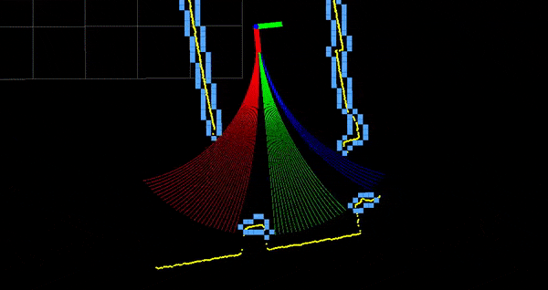
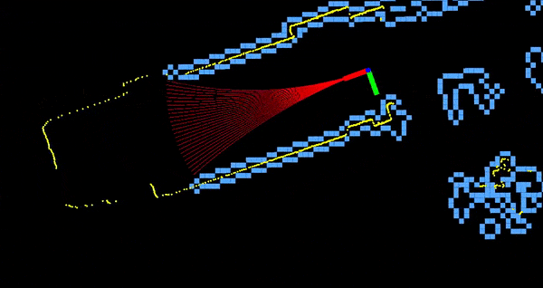

# DWAL Planner
## _Dynamic Window Arc-Line Planner_

The DWAL Planner is a ROS package for creating motion clusters while moving in an obstacle-laden environment. The package has been tested in an office environment, where it works best. It's based on the well known Dynamic Window Approach but instead of projecting arcs ahead, it uses a combination of arcs and lines. These are checked for colission up to a circle of set radius ahead, the so-called *level*. To use it you must have:

- a robot
- an odometry source
- a laserscan source

    <table width="100%"> 
    	<tr> 
    		<td></td> 
    		<td></td> 
    	</tr> 
    </table> 

For more information see the papers below:

*Moustris, G.P., and C. S. Tzafestas. “**Intention-Based Front-Following Control for an Intelligent Robotic Rollator in Indoor Environments.**” In Computational Intelligence (SSCI), 2016 IEEE Symposium Series On, 1–7. IEEE, 2016. http://ieeexplore.ieee.org/abstract/document/7850067/.*

*Moustris, G. P., and C. S. Tzafestas. “**Assistive Front-Following Control of an Intelligent Robotic Rollator Based on a Modified Dynamic Window Planner.**” In 2016 6th IEEE International Conference on Biomedical Robotics and Biomechatronics (BioRob), 588–93, 2016. https://doi.org/10.1109/BIOROB.2016.7523689.*

## Features

- Simulate admissible paths into the environment to detect colission
- Produce admissible clusters of motion
- Can simulate paths in more than one levels at the same time
- Publish the simulated paths, up to their colission point
- Publish the available motion clusters in different colors
- Use services to actually toggle levels on and off
- You can also toggle *directional slicing* of clusters (see the papers for details)

## Installation

Download the package into your ROS workspace and catkin_make it. This is a ROS 1 version (noetic build).

## License

MIT

**Free Software, Hell Yeah!**

